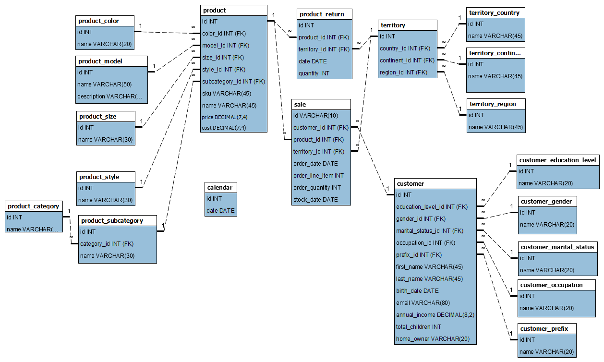

# Hackathon Santo Digital

## Desafio 1

### Tecnologias Utilizadas

* mysql
* mysql.connector
* mysql Workbench
* pandas
* python
* matplotlib.pyplot
* numpy
* sklearn.linear_model

### Tarefa I

1. Modelei o banco de dados a partir dos csv
2. Fiz a normalização das tabelas para garantir a consistência dos dados
3. Apos a modelagem construi o [banco de dados](data/data.sql)

### Tarefa II

#### Item I

1. Selecionei os campos de interesse
2. Fiz a junção das outras tabelas nescessárias
3. Filtrei os registros do ultimos dois anos